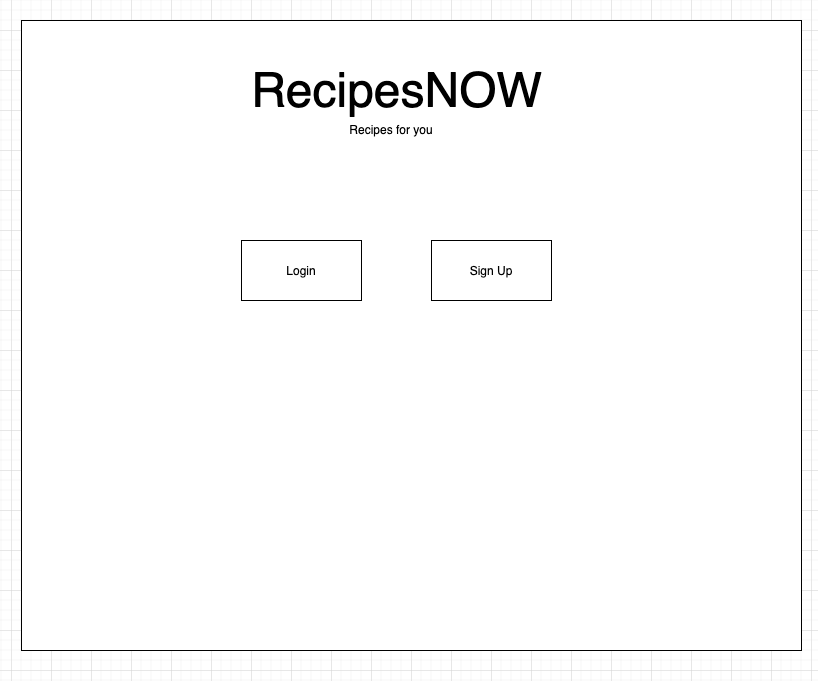
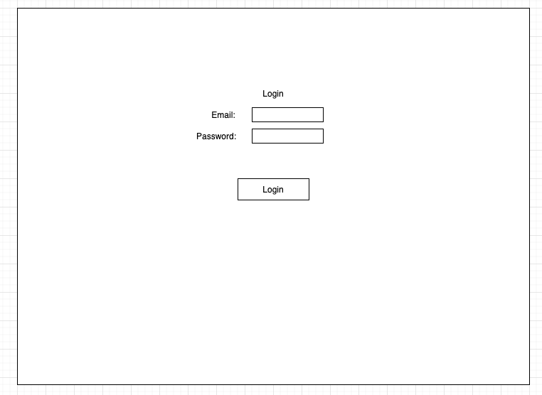
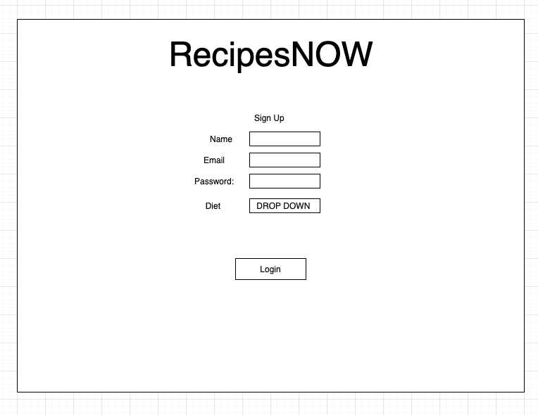
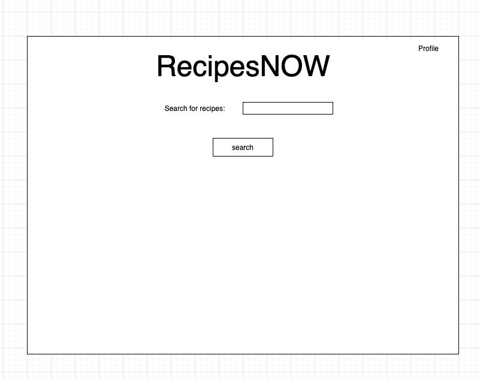
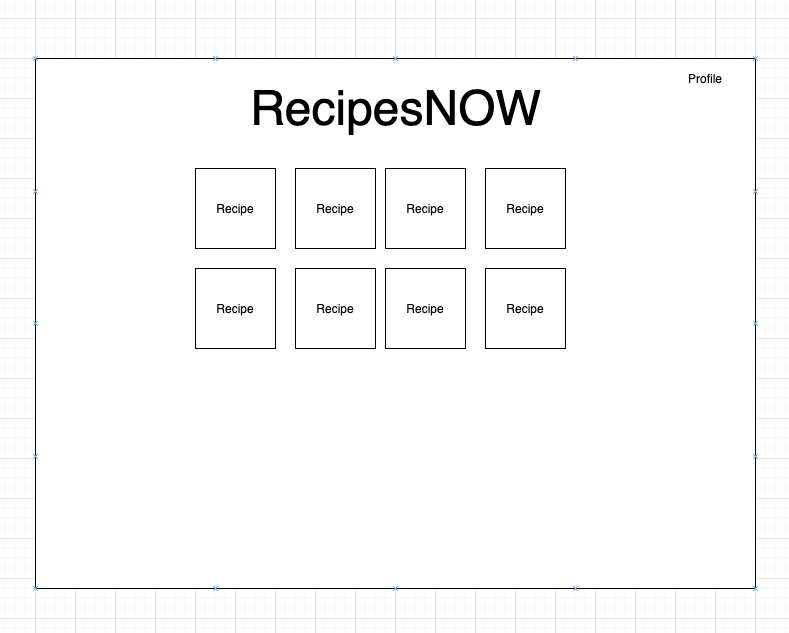
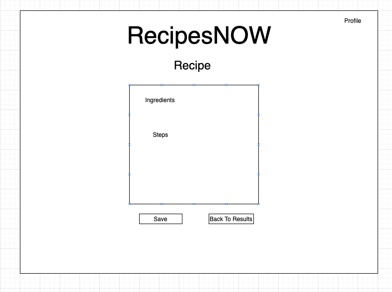
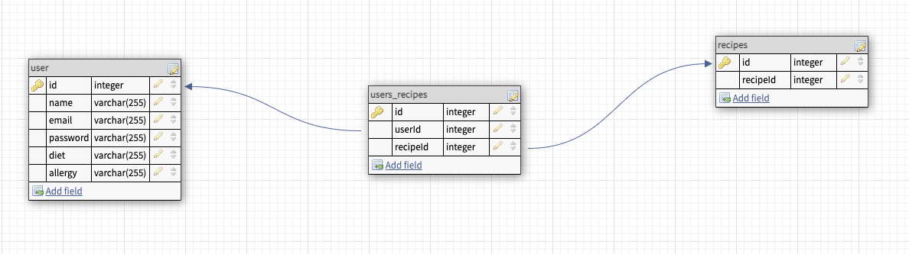

# RecipesNOW
## Objective
    RecipesNOW is an application to provide recipes to users while
    also considering users dietary restrictions. Users will be able
    to provide their dietary restrictions on sign up, so while using
    the application, all their search results will be tailored to their
    diet. This application uses the spoonacular API.  

## Wireframes

## Routes

    -POST /users (create user)
    -POST /users/login (user login)
    -POST /users/:userId/save/:recipeId (user saves recipe)
    -GET /users/:userId/getSavedRecipes (display user's saved recipes)
    -DELETE /users/:userId/delete/:recipeId (user delete saved recipe)
    -POST /recipe (display recipe search results)
    -GET /recipe/:recipeId (display one recipe)

## User Stories
    -On load display sign up and login buttons
    -Click login and a form appears to put in email and password
    -Click signup and a form appears to put in name, email, password, and diet drop down
    -If login or sign up is successful, page displays a search bar and profile link at the top corner of the page
    -Use the search bar to search for recipes (i.e. Tacos, Salad, Sandwich, etc...)
    -After search, display results with picture, if no results, display no results found
    -Clicking on picture of recipe displays the ingredients and steps and a save button and back to results button
    -Click save button and the recipe is saved to the profile page
    -Click back to results and the results are shown 
    -Click profile link and the user's saved recipes are displayed with a delete button to remove the saved recipe
    
    
## MVP
    -Login & Signup
    -User Authorization
    -Be able to search for recipes that align with their diet
    -Save recipes
    -Saved recipes show on their profile
    -Log out 

## Stretch
    -Add allergy param on sign up and use during searches  
    -Be able to change diet & allergy in profile
    -Make something that doesn't look like shit for once